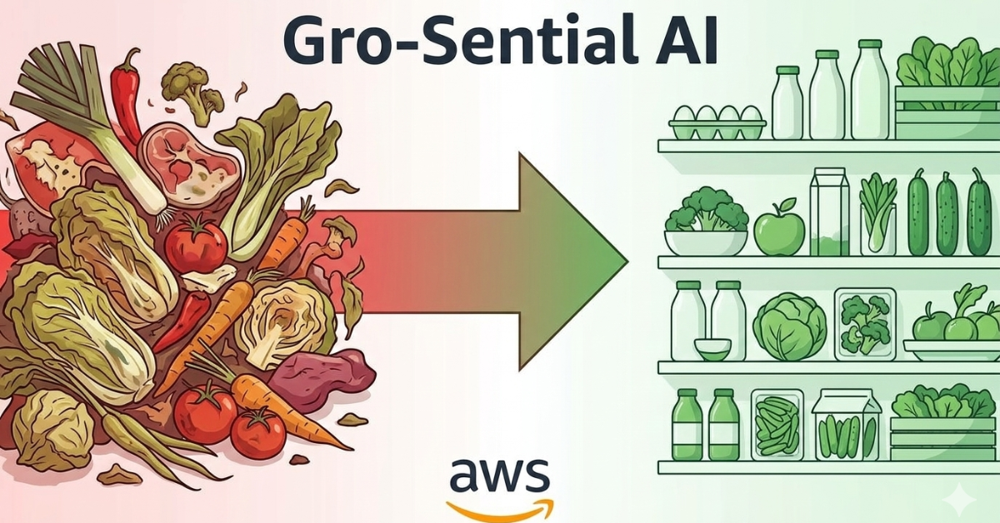

# 🥗 Gro-Sential AI



[](https://opensource.org/licenses/MIT)
[](https://www.python.org/downloads/)
[](https://aws.amazon.com/)

> **AI-Powered Food Waste Reduction Platform**

Reducing food waste through intelligent inventory management, smart trading, and AI-powered recipe generation.

📖 **Read the Full Article**: [AWS Builders - AIdeas 2025](https://builder.aws.com/content/3AjyCEomS3A3EW2rRuRWuoR8Af7/aideas-gro-sential-ai-ai-powered-food-waste-reduction-platform)

🌐 **Try the Live Demo**: Link available in the article above

💡 **Best viewed on laptops, desktops, or tablets in landscape mode for optimal experience**

Created by **Suhas Reddy Kotla** | [GitHub](https://github.com/Kotlasuhasreddy123) | [LinkedIn](https://www.linkedin.com/in/suhasreddykotla)

---

## 🌟 Overview

Gro-Sential AI helps reduce food waste by leveraging AWS AI services to:

- 📸 **Scan & Track** - AI image recognition automatically identifies and catalogs food items
- ⏰ **Smart Alerts** - Get AI-powered notifications before food expires
- 🤝 **Trade Items** - Exchange surplus food with nearby users
- 👨‍🍳 **Recipe Generation** - Get personalized recipes based on available ingredients
- 💬 **AI Chatbot** - Ask questions about food storage, recipes, and nutrition

---

## 🎯 Key Features

### AI-Powered Food Detection
Upload photos of groceries and AWS Rekognition automatically identifies items, extracts expiry dates, and estimates market value.

### Intelligent Expiry Alerts
AWS Bedrock (Claude 3 Haiku) analyzes your inventory and sends personalized alerts for items nearing expiration with optimal usage strategies.

### Smart Trading System
List items you want to trade, browse available items from other users, negotiate trades with counter-offers, and track real-time trade status.

### AI Recipe Generator
Input available ingredients and get creative, personalized recipes with cooking instructions, optimized to use expiring items first.

### Intelligent Chatbot
Powered by AWS Bedrock, ask about food storage tips, get recipe suggestions, and learn about nutrition.

---

## 🏗️ Tech Stack

**Backend:**
- Python 3.9+ with Flask
- AWS Bedrock (Claude 3 Haiku)
- AWS Rekognition
- AWS DynamoDB
- Boto3 (AWS SDK)

**Frontend:**
- HTML5/CSS3
- Vanilla JavaScript
- Responsive Design

---

## 🚀 Quick Start

### Prerequisites
- Python 3.9+
- AWS Account with configured credentials
- Git

### Installation

```bash
# Clone the repository
git clone https://github.com/Kotlasuhasreddy123/Gro-Sential-AI.git
cd Gro-Sential-AI

# Install dependencies
pip install -r requirements.txt

# Set up environment variables (see .env.example)
# Add your AWS credentials

# Create DynamoDB tables
python create_tables.py

# Run locally
python server.py
```

Open browser at `http://localhost:5000`

---

## 📊 Database Schema

- **Users Table**: Email, Name, Password, Location
- **Inventory Table**: ItemID, UserEmail, ItemName, Quantity, ExpiryDate, MarketValue
- **Trades Table**: TradeID, RequesterEmail, ProviderEmail, RequestedItems, OfferedItems, Status

---

## 🤝 Contributing

Contributions are welcome! Please:

1. Fork the repository
2. Create a feature branch
3. Commit your changes
4. Push to the branch
5. Open a Pull Request

---

## 📝 License

This project is licensed under the MIT License - see the [LICENSE](LICENSE) file for details.

**Note:** The "Gro-Sential AI" name and branding are trademarked by Suhas Reddy Kotla.

---

## 📧 Contact

**Suhas Reddy Kotla**
- Email: suhasreddykotla222@gmail.com
- LinkedIn: [linkedin.com/in/suhasreddykotla](https://www.linkedin.com/in/kotla-suhas-reddy)
- GitHub: [@Kotlasuhasreddy123](https://github.com/Kotlasuhasreddy123)

---

## 🙏 Acknowledgments

- AWS for cloud infrastructure and AI services
- Claude (Anthropic) for powering intelligent features
- Lewis University for academic support

---

**Made with ❤️ by Suhas Reddy Kotla**

*Reducing food waste, one meal at a time.*
